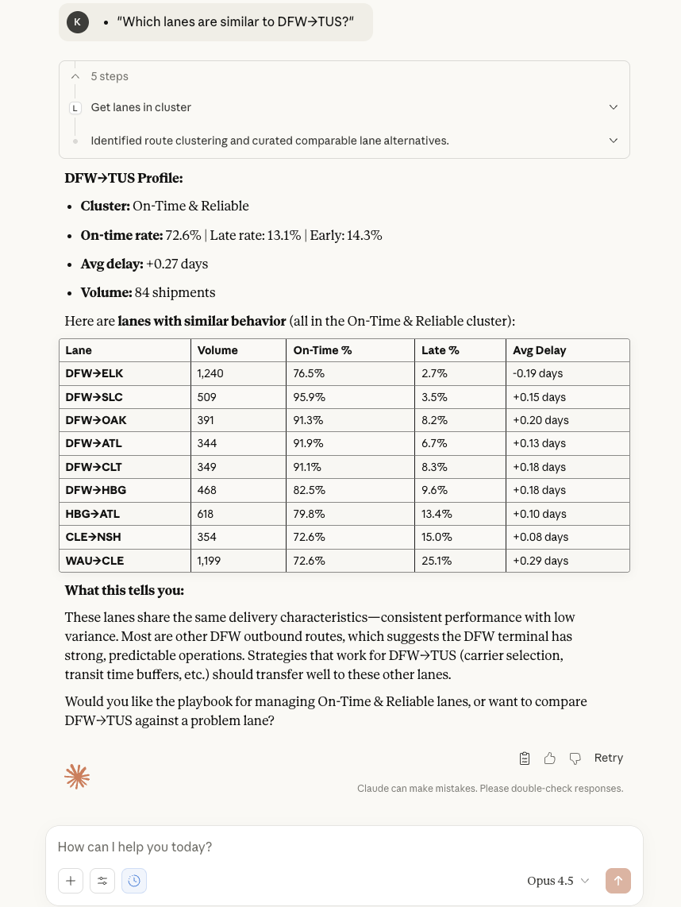
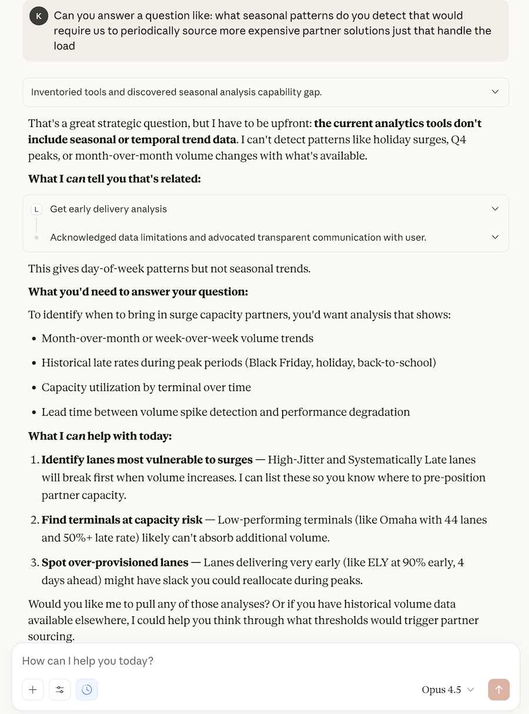

# NYC Last-Mile Delivery Analytics

> **Epiroc Last-Mile Delivery Optimization AI & Data Hackathon**

An AI-powered analytics platform that transforms raw shipment data into actionable delivery insights. Ask questions in plain English through Claude Desktop and get instant answers about your logistics network.

**73,000 shipments • 970 lanes • 117 carriers • 5 behavioral clusters**

---

## 🎯 Talk to Your Data

Connect Claude Desktop to your delivery data and have a conversation:

```
"What's the state of our delivery network?"
"Where are my biggest friction zones?"
"Show me all systematically late lanes"
"What's the playbook for high-jitter lanes?"
"How is the Phoenix region performing?"
"Are there lanes delivering too early that I could optimize?"
"Compare performance of my Texas terminals"
"If I want to improve on-time from 64% to 75%, where should I focus?"
```

| Cluster Analysis | Seasonal Patterns |
|------------------|-------------------|
|  |  |

---

## 🚀 Quick Start

### 1. Build Everything

```bash
git clone https://github.com/kpernyer/nyc-last-mile.git
cd nyc-last-mile
cargo build --release
```

### 2. Start the API Server

```bash
./target/release/api_server --rest-only
```

### 3. Configure Claude Desktop

Edit `~/Library/Application Support/Claude/claude_desktop_config.json`:

```json
{
  "mcpServers": {
    "last-mile-analytics": {
      "command": "/path/to/nyc-last-mile/target/release/mcp_server",
      "args": [],
      "env": {
        "LASTMILE_API_URL": "http://localhost:8080"
      }
    }
  }
}
```

### 4. Restart Claude Desktop and Ask Away!

> "Give me an executive summary of our delivery network"

---

## 📊 The Analytics

### What Questions Can You Answer?

| Analytics Type | Question | What You Learn |
|----------------|----------|----------------|
| **Descriptive** | What is happening? | 64% on-time rate, 73K shipments, volume by mode |
| **Diagnostic** | Why is it happening? | Carrier performance gaps, lane-level problems |
| **Predictive** | What will happen? | Delay probability, risk scoring by lane |
| **Prescriptive** | What should we do? | Carrier switches, SLA adjustments, playbooks |
| **Clustering** | How do lanes behave? | 5 behavioral patterns with strategies |

### The 5 Lane Clusters

The system automatically classifies your 970 shipping lanes into behavioral clusters:

| Cluster | Lanes | Description | Strategy |
|---------|-------|-------------|----------|
| 🟢 **Early & Stable** | 74 | Consistently 0.5-2 days early | Hold-until policies, tighten SLA |
| 🔵 **On-Time & Reliable** | 344 | High on-time, low variance | Benchmark these, protect capacity |
| 🟡 **High-Jitter** | 38 | OK average, unpredictable | Add buffer days, no guarantees |
| 🔴 **Systematically Late** | 73 | Consistently miss SLA | Downgrade promises, switch carriers |
| ⚪ **Low Volume** | 3,903 | Insufficient data | Conservative buffers, monitor |

### Sample Analytics Output

| Report | Description |
|--------|-------------|
| [Descriptive Analytics](./results/analytics-descriptive-results.md) | KPIs, OTD rates, volume trends, transit distributions |
| [Diagnostic Analytics](./results/analytics-diagnostic-results.md) | Carrier benchmarking, problem hotspots, variance analysis |
| [Predictive Analytics](./results/analytics-predictive-results.md) | Delay probability, risk scoring, volume forecasting |
| [Prescriptive Analytics](./results/analytics-prescriptive-results.md) | Optimization recommendations, SLA strategies |
| [Clustering Analytics](./results/analytics-clustering-results.md) | Lane clusters, playbooks, similarity analysis |

---

## 🎬 Demo Script

For a guided walkthrough, see **[docs/DEMO_SCRIPT.md](docs/DEMO_SCRIPT.md)**

### 5-Minute Demo Flow

**Act 1 - The Big Picture**
> "Give me an executive summary of our delivery network"

**Act 2 - Find Problems**
> "Where are our biggest friction zones?"
> "Show me the lanes that are systematically late"

**Act 3 - Hidden Opportunities**
> "Are there lanes where we're arriving too early?"
> "Rank our distribution centers by performance"

**Act 4 - Get Recommendations**
> "What's the playbook for our late lanes?"
> "Find similar lanes to DFW→Denver so I can fix them all at once"

**Act 5 - Strategic Planning**
> "If I want to improve on-time from 64% to 75%, where should I focus first?"

---

## 🔌 MCP Server Architecture

The Model Context Protocol (MCP) server lets Claude Desktop query your analytics in real-time:

```
┌─────────────────┐     ┌─────────────────┐     ┌─────────────┐     ┌──────────┐
│ Claude Desktop  │────▶│   MCP Server    │────▶│ API Server  │────▶│ SurrealDB│
│  (asks questions)│     │ (thin client)   │     │ (REST+gRPC) │     │ (cached) │
└─────────────────┘     └─────────────────┘     └─────────────┘     └──────────┘
```

### Available MCP Tools

| Tool | What It Does |
|------|--------------|
| `get_lane_clusters` | Overview of all 5 behavioral clusters |
| `get_lanes_in_cluster` | List lanes in a specific cluster |
| `get_lane_profile` | Deep dive on a specific route |
| `get_cluster_playbook` | Recommended actions for a cluster |
| `find_similar_lanes` | Find routes with similar patterns |
| `get_early_delivery_analysis` | Identify over-performing lanes |
| `get_regional_performance` | Geographic performance breakdown |
| `get_friction_zones` | High-problem destinations |
| `get_terminal_performance` | DC/warehouse benchmarking |

---

## 📥 Data Pipeline: CSV → SurrealDB

### How Data Flows

```
CSV File (raw shipments)
    │
    ▼
┌─────────────────────────────────────────────────────────┐
│  INGEST BINARY                                          │
│  • Parses CSV with shipment records                     │
│  • Calculates transit days, OTD status                  │
│  • Extracts ZIP3 codes for origin/destination           │
│  • Maps carrier codes to fictional names                │
│  • Assigns distance buckets                             │
└─────────────────────────────────────────────────────────┘
    │
    ▼
┌─────────────────────────────────────────────────────────┐
│  SURREALDB (RocksDB backend)                            │
│  • shipment table: 72,965 records                       │
│  • carrier table: 117 carriers                          │
│  • location table: 806 ZIP3 regions                     │
│  • lane table: 970 origin→destination pairs             │
└─────────────────────────────────────────────────────────┘
    │
    ▼
┌─────────────────────────────────────────────────────────┐
│  API SERVER (cached queries)                            │
│  • Aggregates lane metrics on first request             │
│  • Assigns cluster IDs based on behavior                │
│  • Caches results for fast subsequent queries           │
└─────────────────────────────────────────────────────────┘
```

### Ingest Your Own Data

```bash
# CSV format: load_id, carrier, mode, ship_date, delivery_date, origin_zip, dest_zip, distance
./target/release/ingest raw-data/your-shipment-data.csv
```

The ingest process:
1. **Parses** each row and validates data
2. **Calculates** actual vs. goal transit days
3. **Classifies** as Early/OnTime/Late
4. **Extracts** ZIP3 codes (first 3 digits)
5. **Creates** lane records (origin→destination)
6. **Stores** everything in SurrealDB

### Shipment Data Model

```rust
struct Shipment {
    load_id: String,
    carrier_mode: CarrierMode,      // LTL, Truckload, TL Flatbed, TL Dry
    actual_ship: DateTime,
    actual_delivery: DateTime,
    goal_transit_days: i32,
    actual_transit_days: i32,
    otd: OtdDesignation,            // Early, OnTime, Late
    origin_zip: String,             // ZIP3 code
    dest_zip: String,               // ZIP3 code
    distance_bucket: String,        // 0-100, 100-250, 250-500, etc.
}
```

---

## 🌐 REST API

The API server exposes all analytics via REST (and gRPC):

```bash
# Start the server
./target/release/api_server --rest-only

# Example queries
curl http://localhost:8080/api/v1/stats
curl http://localhost:8080/api/v1/clusters
curl http://localhost:8080/api/v1/clusters/4/lanes  # Systematically late
curl http://localhost:8080/api/v1/analysis/friction?limit=5
curl http://localhost:8080/api/v1/regions/DEN
```

### Endpoints

| Endpoint | Description |
|----------|-------------|
| `GET /api/v1/health` | Health check |
| `GET /api/v1/stats` | Network statistics |
| `GET /api/v1/lanes` | All lanes with metrics |
| `GET /api/v1/lanes/:origin/:dest` | Single lane profile |
| `GET /api/v1/clusters` | All 5 clusters |
| `GET /api/v1/clusters/:id/lanes` | Lanes in cluster |
| `GET /api/v1/clusters/:id/playbook` | Recommendations |
| `GET /api/v1/regions/:zip3` | Regional performance |
| `GET /api/v1/analysis/friction` | Problem destinations |
| `GET /api/v1/analysis/terminals` | DC performance |
| `GET /api/v1/analysis/early` | Early delivery patterns |
| `GET /api/v1/search/similar?lane=X` | Similar lanes |

---

## 🛠 All Binaries

| Binary | Purpose |
|--------|---------|
| `ingest` | Load CSV → SurrealDB |
| `api_server` | REST + gRPC API server |
| `mcp_server` | Claude Desktop integration |
| `analytics_descriptive` | What is happening? |
| `analytics_diagnostic` | Why is it happening? |
| `analytics_predictive` | What will happen? |
| `analytics_prescriptive` | What should we do? |
| `analytics_clustering` | How do lanes behave? |
| `demo_stats` | Quick database overview |
| `demo_carriers` | Carrier performance |
| `demo_lanes` | Lane analysis |
| `demo_otd` | On-time delivery analysis |
| `demo_search` | Interactive search |

---

## 📁 Project Structure

```
nyc-last-mile/
├── src/
│   ├── bin/
│   │   ├── ingest.rs              # CSV → SurrealDB
│   │   ├── api_server.rs          # REST + gRPC server
│   │   ├── mcp_server.rs          # Claude Desktop MCP
│   │   ├── analytics_*.rs         # Analytics binaries
│   │   └── demo_*.rs              # Demo tools
│   ├── api/
│   │   ├── mod.rs                 # API module
│   │   ├── service.rs             # Shared business logic
│   │   ├── handlers.rs            # REST handlers
│   │   └── grpc.rs                # gRPC implementation
│   ├── models.rs                  # Data models
│   ├── db.rs                      # SurrealDB connection
│   ├── carrier_names.rs           # Fictional carrier names
│   └── location_names.rs          # ZIP3 → city mapping
├── proto/
│   └── lastmile/v1/analytics.proto  # gRPC definitions
├── data/
│   └── lastmile.db/               # SurrealDB database
├── results/                       # Sample analytics output
├── docs/
│   ├── DEMO_SCRIPT.md             # Guided demo walkthrough
│   └── CLAUDE_DESKTOP_SETUP.md    # Setup instructions
└── raw-data/                      # Source CSV files
```

---

## 🧰 Technology Stack

| Component | Technology |
|-----------|------------|
| Language | Rust |
| Database | SurrealDB (RocksDB backend) |
| API | Axum (REST) + Tonic (gRPC) |
| Protocol | MCP (Model Context Protocol) |
| AI | Claude Desktop |
| Serialization | Protobuf, JSON |

---

## 📄 License

MIT

---

*Built for the Epiroc Last-Mile Delivery Optimization Hackathon*
